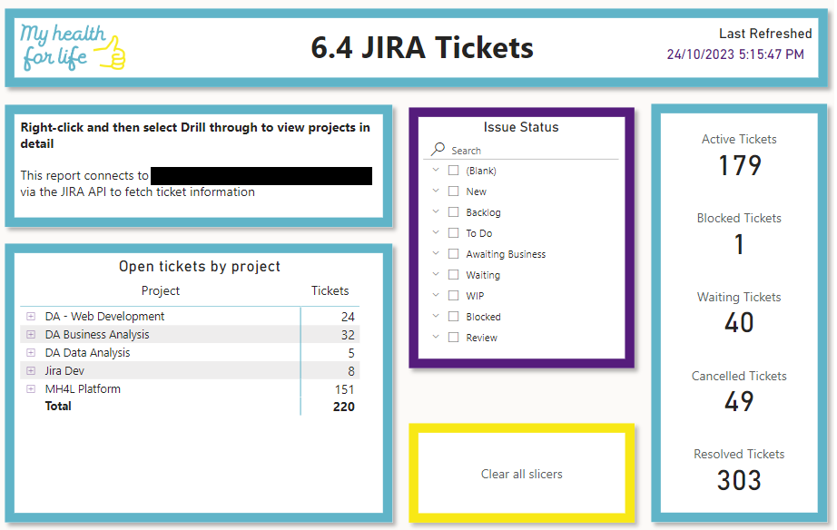
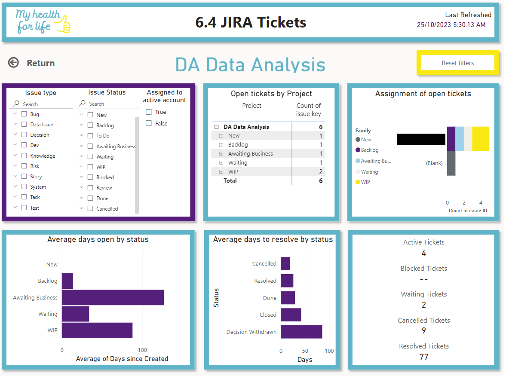

# JIRA Report
## Purpose: Show the active tickets in JIRA to users without JIRA access
Pull in all the JIRA tickets, and present their status, priority and timeframe to buisness users, as only developers and select buisness users have JIRA accounts. 

Supplement JIRA's internal tools for searching and visualizing, as the suite of reports inside JIRA is pretty limited

This pulls via JIRA's API, and pulls down all boards linked to YOUR_JIRA_DOMAIN (running as my JIRA account, via my JIRA API token, this should be changed to use a Service Account). As each board has it's own workflows and statuses, there is a significant amount of status/encoding mapping happening to produce a set of standardized statuses. 

#### What is a JIRA issue?
JIRA calls all items "issues". 
These could be a requirement story, a bug, a task, a question, a subtask, a decision record, or any number of custom issue types. They don't necessarily represent "problems" that need to be solved. 

## Pages
#### Landing
This page provides high level totals, and the ability to view counts of open tickets, by category, within each project
{width=800}

#### Board Drillthrough - Summary
This page provides a high level picture of the specified JIRA project; 
- who's assigned what
- how long things stay open/take to close

{width=800}
(There is also a drillthrough page to which shows specifics of each issue, in a big table)

#### Linked Issues
This page shows where there's a connection between tickets, and presents details and a hierarchy tree for parent & child issues. 
The objectives of this page are:
{width=800}
- Reduce angst around high ticket counts, but explaining JIRA's connected issue functionality
- Provide a catch for forgotten child issues, and help identify bottlenecks

#### Datasets
- JIRA API
    - Issues
    - Linked issues: issues which have a hierarchical relationship to other tickets (i.e. subtasks)
    - Fact tables:
        - Devs: accounts of the developers
        - Issue types: categories, i.e. bug, dev task, user story...
        - Priorities: highest, high, med, low....
        - Environments: Prod/UAT/Staging/Dev
        - Fixes: Releases & Hotfixes
        - Projects: JIRA projects/boards, which contain all the issues
        - Status codes: mappings of the status codes from all projects to standardized format/grouping. Includes a "is terminal" flag, used to exclude resolved tickets
- DateDimension: calendar table for better datetime analysis/plotting

#### Measures
- Tickets	number of items in JIRA, based on their created date
- Blocked Tickets	number of items marked as Blocked, meaning another item needs to be solved first
- Cancelled Tickets	number of items that have been cancelled for some reason, i.e. 
	- won't do
	- no longer required
	- can't do
	- duplicated
- Resolved Tickets	number of items that have been marked as completed
- Waiting Tickets	number of items set as "waiting" (scheduled for development in the future) or awaiting business input
- Active Tickets	number of tickets that don't fall into one of the other categories. 

This should capture all the stuff that is currently open and being worked on

