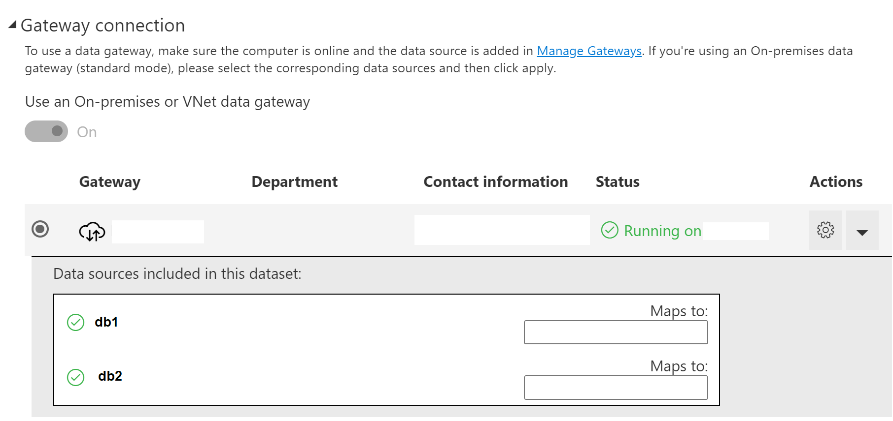
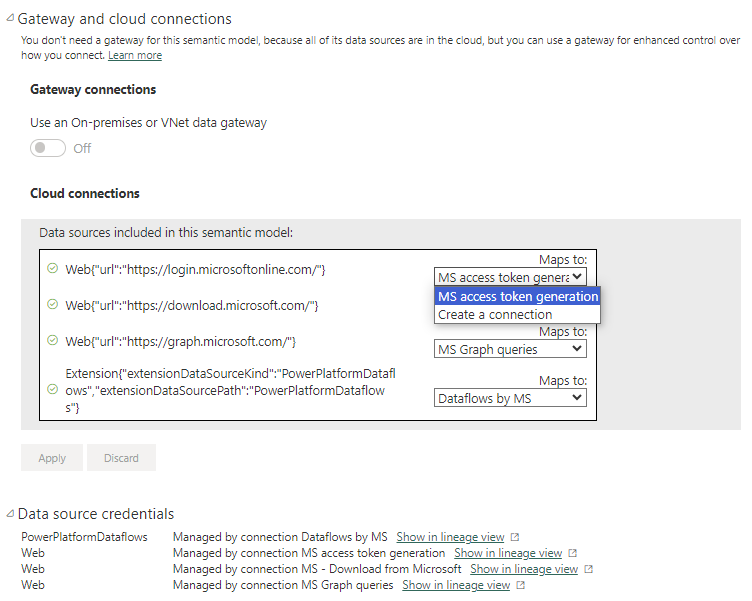
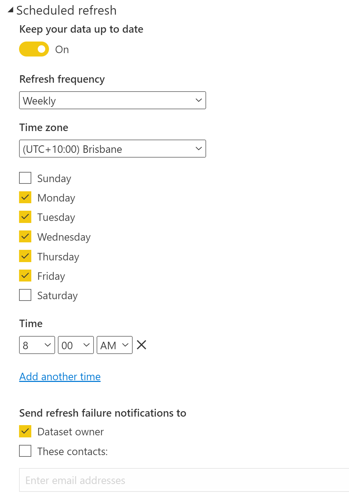
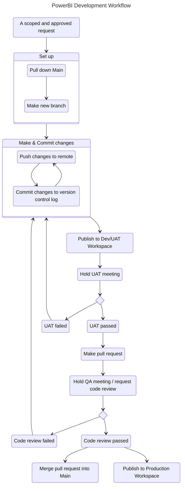
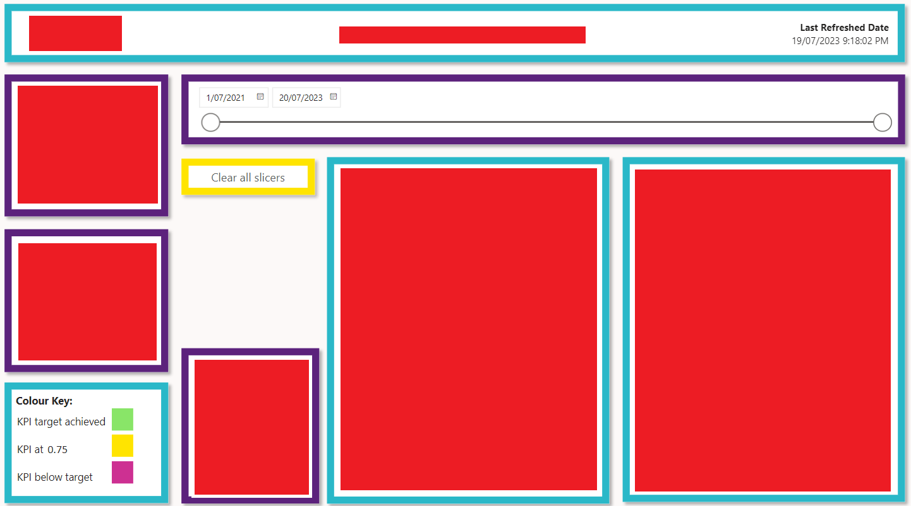
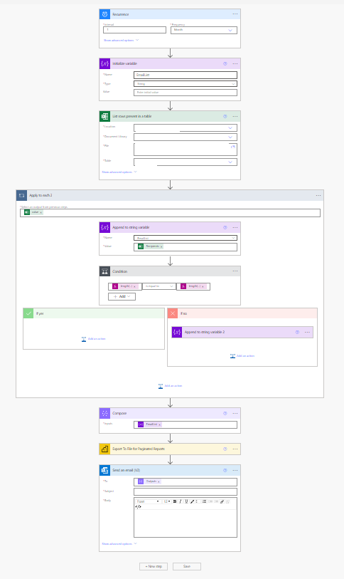
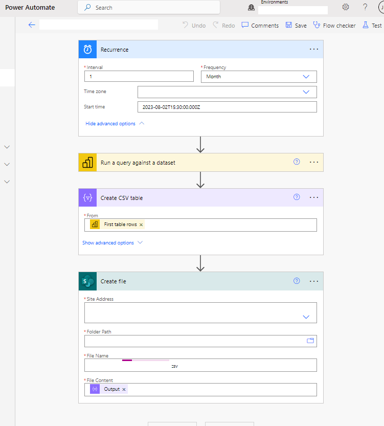

# What is this place??
__A repo containing code for the [INSERT HERE] Power BI environment.__
__DO NOT Upload .pbix files__, because `.pbix` type files contain the associated data (if providing legacy support, these should be stored in SharePoint).

#### Authors: 
Who | Role
----|---------
Jack MacCormick (JM)    |   Data Analyst (DA)
Andrew Robinson (AR)    |   Data Engineer/Architect (_External - SKEDA_)

# Reporting Guide for Data Analysts
This PowerBI delivery article is based on content from Andrew Robinson’s original knowledge base article.

## 00 Scoping and Requests
Requests for new reports and interactive dashboards should come in via an IT Service Management portal, _i.e HALO ITSM or JIRA_, which provide workflow intergration, approvals and triage. 

Currently DMWG requests do not have a standardised lodgement system and are handled manually. This should be rectified. These manual items are then uploaded into JIRA as `Tasks`. 

If the requests came in via HALO ITSM, they would need to be cloned across into JIRA. 

Convert the request into the following requirements template. 

    Ticket No: 
    
    Purpose:
        1. 

    Audience:
    - Internal
		a. 
	- External
        b. 

    Design features
        - 

    Graphs desired: 
        - 

    Tables desired
        - Table 1
            1. Countable:
                ○ 
            2. Disaggregations:
                ○ 
        - ...

    Data sources:
        Primary
            - 
        Secondary
            - 
        Refresh frequency: [Daily, 2+/week, Weekly, Monthly, Quarterly…]

## 00 Data sources - Using the gateway
__PowerBI can be setup with a data gateway which allows for data sets to be refreshed by the platform.__ 

This allows users to view reports and datasets without requiring them to have permission to the data sources _(i.e., sql servers or other data sources)_, as PowerBI handles this for them. 

In order to have your PowerBI data source work through the gateway, your data source settings <u>MUST</u> match the gateway data source settings <u>EXACTLY</u>. 

Once you have created your data source in your report using the above details, and you publish the report to the PBI Platform (_online "Service"_), you have to edit the Dataset / "Semantic Model" and enable the system to use the gateway source. Access the PBI Portal and find your data set, edit the data set settings and you should see the option to enable the use of data gateway for your report's data set, as below;



If you don't see this option then you either;
1. Don't have permissions to the data gateway source, or 
0. Don't have the identical names for server and database.

If you are connecting out to a Web source, either connect to an existing named connection where one exists, or create a new named connection & share this with other users (via an Azure AD Group).

Once you have the data gateway/cloud-connection option enabled, you have to map your data sources to the data gateway sources using the dropdown lists.



You should also setup the refresh schedule shown in the image below:



There is a maximum of 8 times per 24hrs that you can set. The default is every 24hrs. Times closer than 1hr are not recommended as the platform only refreshes within the hour scheduled.

You should also be able to test your data gateway refresh by running a Manual / OnDemand refresh on the Dataset / "Semantic Model".

## 01 Initial development
NB: Develop reports in the PowerBI desktop client, not on the service portal.
#### Development workflow Steps
1. __Create a Branch for your project / change.__
    This should be named `JIRA-PROJECT_CODE-XX` if it's referencing a JIRA ticket, where `project_code` is the project board & `XX` is the item's ticket ID number. 
    This will be where you develop, so that changes are isolated, logged and can be merged in a documented way. 
0. __Create a new folder (if required)__
    For new dashboards, create a new folder w/ the ID number corresponding to the report being created, _i.e 03.05 if it's the 5th report in the 03 workspace_. 

    ``` mermaid
    gitGraph:
        commit id:"history"
        commit id:"current state"
        branch 034-developmentBranch
        checkout 034-developmentBranch
        commit id:"modify/create 034"
    ```
0. __Create/open a Power BI Project `.pbip` file which you develop in inside the applicable report folder, inside the cloned instance of this Repo.__

    Doing so will mean your work can be saved and commit with annoated changes, and allows you to rollback to a previous version if there is a problem with the report.
    - As `.pbip` Project files are a "Preview feature", you will need to enable this setting under the PowerBI options menu. 
    - This filetype is designed to work with version control software, allowing us to see exaclty what changed. You can read Microsoft's documentation [here](https://learn.microsoft.com/en-us/power-bi/developer/projects/projects-overview)
0. __Commit and push your changes__
    - Commits are where you add changes to your local change log
    - Pushes are when you send that change log up to the cloud, so it's stored somewhere safe and accessible to others. 
    
    ``` mermaid
    gitGraph:
        commit id:"history"
        commit id:"current state"
        branch 034-developmentBranch
        checkout 034-developmentBranch
        commit id:"modify/create 034"
        commit id:"some development"
    ```
0. __Once your `.pbip` file is ready for testing in the portal, please publish it a the `Dev/UAT Workspace`.__ 
    1. Don't publish files to your personal workspace!!
        - it makes it difficult to share development, as you can't collaborate with others.
        - if you leave access to those reports will be lost. Even if access can be recovered, all the reports will need to be downloaded from your workspace and republished to somewhere else. 
    0. [Hold UAT meetings with your key stakeholders](##-07-User-Acceptance-Testing-(UAT))
        - Only devs should have overall access to the dev workspace, and directly to reports/datasets. 
        - UAT users should be granted access to the WIP reports via the Dev app. 
0. __Also at this stage, you should make a DRAFT Pull Request__. 

    Pull Requests _(PRs)_ are how changes are merged into the Production _("Main")_ branch. They're documented, reviewable change requests, where commentary can be added, differences against the target main branch are shown, and any conflicts spotted and resolved. 
    
    Commits are changes to specific parts of specific files, while pull requests are the summary of net changes. 
    - Someone else will check your work, and approve your Pull Request after QA & UAT.
    - If it's just you, you'll approve your own pull requests, but they're still valuable as they contain the documented history of the Main branch, _i.e. justification of why a measure changed, when the meetings happened and what the impact was._
0. __Code Review.__

    Have someone check your work to make sure your numbers are as they should be, your calculations are efficent and your code is readable.  Even if it works great, someone else needs to be able to read, understand & debug it. 

    Also, this is your oppertunity to learn from others, discover new ways of doing things, and to catch any shortcuts you haven't ammended. 
    
0. __Merging into Production__

    After the pull request is approved and completed, you or the person doing the QA will merge your pull request, and publish the report up to the appropriate PowerBI Workspace.


#### Development workflow diagram


#### Git action during development and QA workflows


## 02 General report creation and conventions:
#### Steps
1. __Choose a workspace for the report__

0. __Create a report name, following the naming conventions:__
    - Reports need a prefix _i.e. 4.1 XXX_
    There is no need for a version / status suffix, as we are using version control and a Development & UAT workspace/app for published drafts. 

    Modifier        |   Element
    ----------------|---------------
    Prefix - Where  |   Workspace no.
    Prefix - What   |   Report no. in workspace
    Name            |   Human friendly Title - keep this consistent with the in-report title

    If you have different names, publishing to the service will not override the existing files & carry over all the settings, so you'll have to:
        - re-configure all the connection settings
        - add the report to the app
        - enable visibility of the report to each appropriate audience

0. __Make a folder for your report__
    - Name the folder with the prefix of your report. 
    If it's an automated paginated report, it should live in `./AutomatedReports`

0. __Develop your report__, per appropriate section below:
    - [Interactive reports](##-03-Power-BI-Interactive-Reports)
    - [Paginated reports](##-04-Paginated-Reports)
0. __Go through UAT processes__
    - See [section on UAT](##-07-User-Acceptance-Testing-(UAT))

0. __Publish to the PowerBI service__
    - Place report within the chosen workspace and set up gateway / refresh settings, per [above](#00-Data-sources---using-the-gateway)

0. __Add the report to that workspace's App__

0. __Add the report within App audiences:__

    The intent is to have no-one in the workspaces themselves, besides IT/Developers. This allows us to provide access exclusively with Azure AD groups, ensuring no-one has links to files which get removed/overridden, and provide needs-based visibility of reports within each workspace/app in an easy to audit way. 

0. __External access:__

    External actors are not being provided with access to PowerBI reports, as that would require DA to provision them a license, or provide them with Azure AD authentication via [business-to-business](https://learn.microsoft.com/en-us/entra/external-id/what-is-b2b) sharing. Instead, external actors are to be provided with Paginated Reports, which can be set to automatically distribute/save using Power Automate flows. 

----------------

## 03 Power BI Interactive Reports
1. __Templates:__
    - Where applicable, copy the PowerBI template _i.e. `./Power BI Template 0.1.pbit`_, and save into the folder in your cloned repsitory as a PowerBI Project type file. This will create your local `.pbip`, which you'll develop and publish to "Power BI (web) service". 
    - Import the colour themes from a `.json` type file, _i.e. from the DA Brand theme_. 
    - Import your data sources as Direct Query if they're not processed APIs or another PowerBI dataset
0. __Query creation:__
    - __Sources:__
    Sources should be parameterised instead of the default fullname, i.e., `Source = Sql.Database(Server, Database)`. This is to allow quick swaps to Dev instances of the datamart for testing ETL changes. 
        ``` dax
        Server = "a.sever.local" meta [
            IsParameterQuery = true
            , List = {"a.sever.local"}
            , DefaultValue = "a.sever.local"
            , Type = "Any"
            , IsParameterQueryRequired = true
        ] // end param
        ```
        
        ``` dax
        Database = "a_Datamart_Prod" meta [
            IsParameterQuery = true
            , List = {
                "a_Datamart_Dev"
                , "a_Datamart_UAT"
                , "a_Datamart_Prod"
            }
            , DefaultValue = "a_Datamart_Prod"
            , Type = "Any"
            , IsParameterQueryRequired = true
        ] // end param
        ```    
    - __Tables:__
    You can directly copy tables from other PowerBI files inside the `Transform` menu, though if there are no further changes to be made, it's recomended to query these in via a connection to the PowerBI dataset on Service. 
    - __Measures & Relationships:__
    Once you have tables established, you can use Tabular editor to copy Measures and Relationships between PowerBI models _(open `.pbix` and any `.pbit` file, open or not)_
0. __Visual elements:__
    - All elements should have a transparent "no-fill" background. 
    - Grouped element should share a  filled "grouping rectangle" shape, which they sit inside. This "grouping rectangle" should have a shadow effect and a 10pt wide border. 
        - I've been using different coloured borders to visually seperate element groups by type, so users have a consistent visual schema. These are based on the loaded `.json` theme file, which is either DA level or program level. 
        _i.e for MH4L:_
            -  for all headers and primary content
            -  for slicers/toggles
            -  for buttons 
            
            
 
-----------------

## 04 Paginated Reports
1. __Templates:__
    - Wireframe `./AutomatedReports/Paginated Report wireframe.svg`
    - Paginated report doco `./AutomatedReports/Paginated Report Doco.md`

0. __Query creation:__
    - Try to keep only the columns you need in paginated report datasets/queries, as extra columns tend to cause slow execution & errors, especially if they contain `NULL` values, even if they're not being returned in the table/graph. 

0. __Saving:__ 

    Save the paginated report into a folder within `./AutomatedReports`, subject to the naming conventions, as [above](#02-Report-Creation-and-conventions).

0. __Publishing:__ 

Publish the report to PowerBI service, into the selected workspace, as [above](#02-Report-Creation-and-conventions). 
If this report needs to be run automatically, or via a trigger, it needs to live in a Premium Per User (PPU) workspace. This will mean users without PPU will __NOT__ be able to access it. 

0. __Power Automate intergration:__

A Power Automate flow can be used to trigger, run exports, and handle the distribution of Paginated Reports. This is limited to once per 5mins (_under a PPU licences_). 
    #### Power Automate Steps:
    1. Create an excel file on SharePoint containing an audience list for the report, with the same name prefix as the dataset/report it will reference, followed by `- Audience`.
    0. Create your Power Automate flow. 
        - This flow should be named with the same name as the associated Paginated Report. 
    0. Set up a recurrence || on-action trigger
    0.  Distribution:
        - a variable is decleared to hold the e-mail receipients
        - the distribution list (DL) is read from the associated audience reference file _(this is so we can edit a simple excel file, rather than requiring a developer to edit (and potentially break) the flow each time the DL changes)_.
        - the DL variable is iteratively added to with all members of the DL.
        - this is then composed to a single string to pass as addressees
    0. An API export query is run against the Paginated Report, including with any parameters, with a specified filetype format.
    0. An email is sent to the DL members, containing the contents of the paginated report as an attachment.
    0. Export your working flow as a `Zip` package, and save it into the `./AutomatedReports` folder of this repo, so that it too is version-controlled. 

    #### Example flow:
    

-----------------

## 06 Periodic Data Extracts
#### Context
__These should be done as in-frequently as possible, and subject to a program-director level approval and data-sharing agreement/contract review.__

While it is possible to supply external partners with raw/sanitised data, it risks that data being taken and mis-represented or shared without our knowledge. To avoid this, raw/sanitised data releases should be avoided unless absolutely required. 

- For example, YOUR AGENCY has a number of complex process interactions, caveats and business rules around what counts as _X_ for various purposes, so data summarisations should be done in-house where possible, to ensure the data is presented and interpretted correctly. 

__Additionally, YOUR AGENCY holds a great deal of personally identifying information (PII) and private/sensitive medical data, so the release method and audience must be carefully considered__, including security in-transit. Even data with identifiers and obvious personal information like names, e-mails and addresses removed can still be identifying, due to the number of demographic factors captured throughout YOUR AGENCY datamarts:

> It's important researchers are aware that data that is not obviously sensitive (no names or dates of birth for example) or that has been de-identified, can become sensitive through triangulation or data linkage.
>
> Triangulation in this context is the process of combining several pieces of non-sensitive information (in the same dataset) to determine the identity or sensitivity of a participant or subject.

Some resources about de-identifying data:
- [Australian Research Data Commons - Identifiable Data](https://ardc.edu.au/resource/identifiable-data/)
- [James Cook University Australia - De-identifying Data 01](https://www.jcu.edu.au/rdim/step-3-archive/you-will-need-to-consider/de-identifying-data)
- [James Cook University Australia - De-identifying Data 02](https://www.jcu.edu.au/rdim/step-1-plan/you-will-need-to-consider/triangulation)

#### Extract Process:
1. A PowerBI dataset should be identified or created to supply the required data, with approriate transformations/index-lookups applied. 
0. This dataset is published to an external reports workspace; `External Reports PPU`
0. A SharePoint folder is created in a shared access space, to ensure authentication and authorisation, _i.e. a locked down folder inside SharePoint_. This is done instead of sending the file via email, which can be read in transit, forwarded or be sent to the wrong recipient. 
0. A Power Automate flow is created to trigger, run the extraction and govern distribution of the data. This flow should be named with the same name as the associated PowerBI dataset. 

##### Steps:
- a recurrence is set up.
- a query is run against the dataset _(use PowerBI's `Optimise %<% performance analyser` for this)_.
- a CSV table is created from this query return.
- the file is saved into the ^^ SharePoint site folder, with an appropriate name _(including flow execution time)_.

##### Example:


## 07 User Acceptance Testing (UAT)
Use the following template when holding a UAT meeting. 

    ## Topics:
	1. Are requirements achieved?
		1
			1.1 
			1.2
			…
		2
			2.1
			…
		…
	2. User Interface:
		Usability 
		- 
		Clarity
		- 
		Tooltips
		- 
		Definitions
		- 
	3. Planned changes
		- 
	4. Improvements
		- 
	5. Others

-------------------

## 08 Post Creation Steps
1. __If report is new:__ 
Submit a ticket to add the new report to the "list of reports" list in Jira, so clients can select it in "Request changes to a report" tickets. 
It'll require JIRA admin permissions to access, but it's included here incase anyone asks what they should be updating. 

0. __Provide report users with a change log:__
This should explain what was added/removed/changed, and why.
The change log should include descriptions of any service impacts, and the associated migitation strategies.
A template is available for this message: `~\SupportingDocs\Release - Patch notes template.txt`

-----------------------------------------
# Setting up ReadMe's

## Getting Started
TODO: Guide users through getting your code up and running on their own system. In this section you can talk about:
1.	Installation process
2.	Software dependencies
3.	Latest releases
4.	API references

## Build and Test
TODO: Describe and show how to build your code and run the tests. 

## Contribute
TODO: Explain how other users and developers can contribute to make your code better. 

If you want to learn more about creating good readme files then refer the following [guidelines](https://docs.microsoft.com/en-us/azure/devops/repos/git/create-a-readme?view=azure-devops). You can also seek inspiration from the below readme files:
- [ASP.NET Core](https://github.com/aspnet/Home)
- [Visual Studio Code](https://github.com/Microsoft/vscode)
- [Chakra Core](https://github.com/Microsoft/ChakraCore)
- [Markdown formatting](https://learn.microsoft.com/en-us/azure/devops/project/wiki/markdown-guidance?view=azure-devops)
